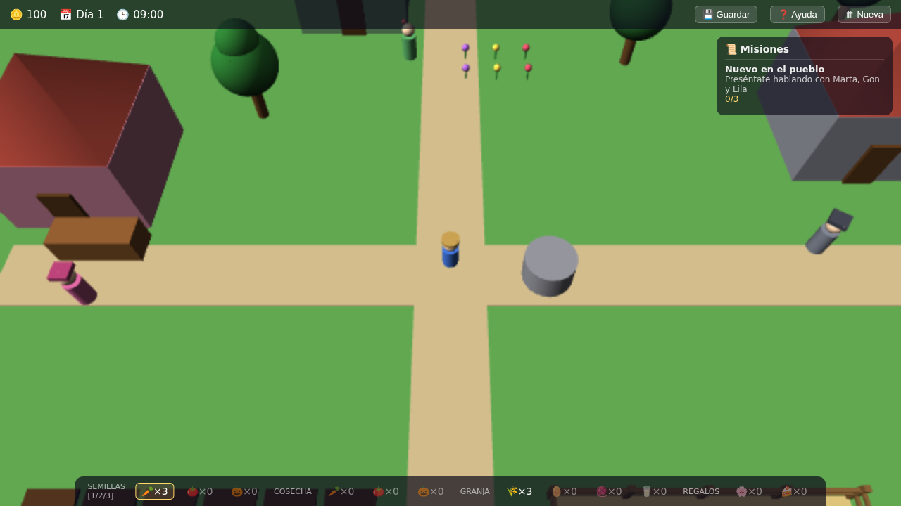

# Pueblo 3D 🌱


Simulador de vida de pueblo en 3D, inspirado en Stardew Valley, que corre directamente en el navegador. Todo el mundo está construido con formas simples (cajas, esferas, cilindros), sin modelos externos — el encanto está en la vida del pueblo, no en los gráficos.



## Qué puedes hacer

- **Cultivar**: planta zanahorias, tomates y calabazas, riégalos cada día (si no, se marchitan) y vende la cosecha.
- **Criar animales**: gallinas, vacas y ovejas te dan huevos, leche y lana si las alimentas a diario.
- **Hacer amigos**: habla con los vecinos y regálales cosas para subir la amistad y descubrir sus diálogos.
- **Completar misiones**: desde presentarte al pueblo hasta entregas y cosechas encargadas.
- **Vivir el paso de los días**: ciclo de día y noche, y la partida se guarda sola al empezar cada día.

## Cómo jugar

```bash
pnpm install
pnpm dev
```

Abre http://localhost:5173 y listo. No hace falta conexión: todo lo necesario va incluido en el proyecto.

- **WASD / Flechas** — moverte
- **E** — interactuar (plantar, regar, cosechar, alimentar, hablar, vender)
- **1 / 2 / 3** — elegir semilla
- **H** — ayuda · **Esc** — cerrar ventanas

## Para desarrolladores

Cómo está hecho por dentro (arquitectura, decisiones técnicas, tests y workflow de issues) se documenta aparte: [`arquitectura.md`](arquitectura.md), [`docs/adr/`](docs/adr/) y [`CLAUDE.md`](CLAUDE.md).
